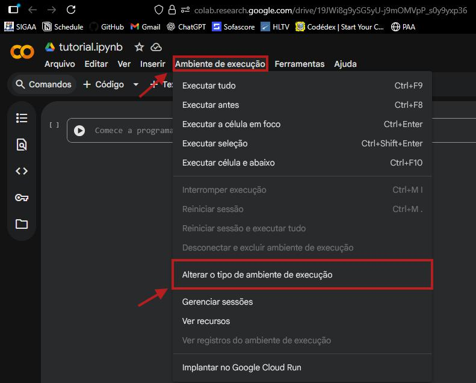
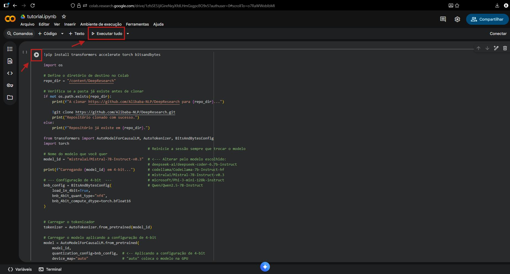
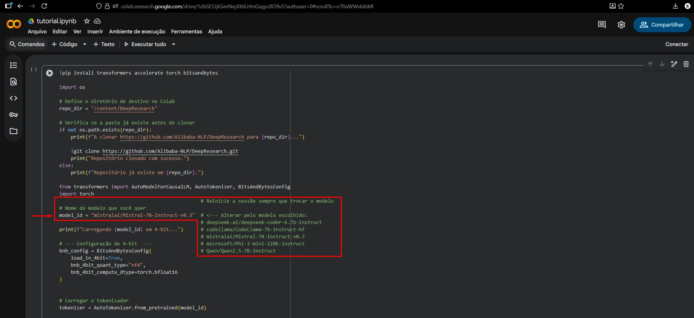
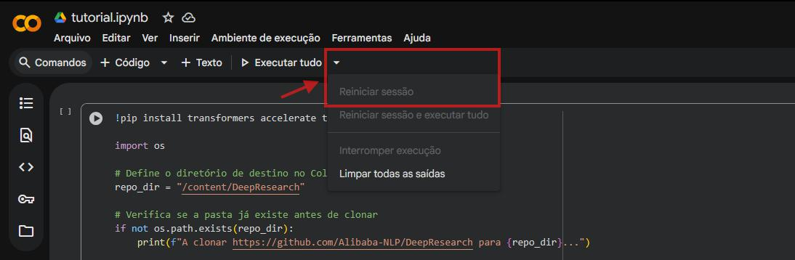

# 📘 Análise de Padrões Arquiteturais do DeepResearch com LLMs
## Equipe 1 - DeepResearch
| Nome                              | Matrícula     | Descrição da atividade                                                                                   |
|----------------------------------|---------------|-----------------------------------------------------------------------------------------------------------|
| Álex Santos Alencar              | 202300061518  | Realização da análise manual do projeto no GitHub.                                                       |
| Ellen Karolliny dos Santos       | 202300114326  | Definição sobre padrões arquiteturais, exemplos sobre os padrões mais conhecidos.                             |
| Gabriel Luiz Santos Gama Barreto | 202300114335  | Auxílio na construção do prompt dos modelos e do tutorial. Análise dos relatórios gerados pelo deepseek e codellama. |
| Gabriel Ramos de Carvalho        | 202300061920  | Ajuda na escolha dos modelos e criação do prompt. Apresentação e discussão dos resultados obtidos a partir do MistralAI. |
| João Andryel Santos Menezes      | 202300061652  | Escolha dos modelos, criação do prompt. Análise dos resultados e apresentação do Phi 3 mini.              |
| Larissa Batista dos Santos       | 202300061705  | Análise e apresentação dos resultados obtidos utilizando o modelo Qwen2.5.                                        |
| Paloma dos Santos                | 202300061723  | Comparação e análise dos modelos selecionados. Ajuda na criação do modelo do documento .docx (Resposta da análise e tutorial). |
| Rauany Ingrid Santos de Jesus    | 202300061760  | Introdução de padrões arquiteturais, auxílio na criação do doc de análise, desenvolvimento dos slides e edição do vídeo. |

### DeepResearch - https://github.com/Alibaba-NLP/DeepResearch (Modelo que será analisado)
---
## Vídeo de apresentação dos resultados do projeto
### [Acessar vídeo](https://drive.google.com/file/d/1LWLBEVQrYNaxog7Xz0Lq3KmnPvoMZx3o/view?usp=sharing)<br>
---
## 📚 Sobre o Tutorial
---
Este tutorial apresenta como objetivo demonstrar o processo, passo a passo, de como identificar os padrões arquiteturais do modelo de linguagem DeepResearch a partir de seu repositório no github, utilizando e simulando três grandes modelos de linguagem (LLMs), executados a partir do Google Colab.
---
## 🚀 Opção de Atalho (Recomendado)
Caso deseje **abrir diretamente o notebook no Google Colab**, sem seguir as etapas iniciais, utilize o link abaixo:

🔗 **Acessar o Notebook no Colab:**  
https://colab.research.google.com/github/GabrielGamaUFS/Engenharia_SoftwareII_2025-2_T04_DeepResearch/blob/main/ESII.ipynb

➡️ **Se utilizar esta opção, você pode seguir diretamente para o passo 2 e logo em seguida para o passo 4 do tutorial.**
---
## 🧭 Tutorial Completo

### 1. Abertura do Ambiente Google Colab (IDE)
Nesta etapa, deve-se acessar o ambiente Google Colab, disponível no endereço https://colab.google/, e criar um “Novo Notebook” ou “New Notebook”.

<p align="center">  </p>

---

### 2. Preparação do Ambiente

Nesse momento é importante definir o uso da GPU no Colab. Para isso, acesse o menu “Ambiente de Execução” na parte superior da página, em seguida pressione “Alterar o tipo de ambiente de execução”, selecione a opção “GPUs: T4” e clique em “salvar”, como segue as figuras:

<p align="center">  </p>

<p align="center">  </p>

---

### 3. Inserção do código-fonte
No ambiente do Google Colab, selecione a célula do código já existente. Caso não haja uma célula já criada, pressione a opção “+  Código” para inserir uma nova. 

<p align="center">  </p>

Em seguida, cole o trecho do código abaixo:

<details>
  <summary><strong>📌 Clique para expandir o código completo</strong></summary>

```python
# 1. Instalar as bibliotecas necessárias

!pip install transformers accelerate torch bitsandbytes

import os

# Define o diretório de destino no Colab
repo_dir = "/content/DeepResearch"

# Verifica se a pasta já existe antes de clonar
if not os.path.exists(repo_dir):
    print(f"A clonar https://github.com/Alibaba-NLP/DeepResearch para {repo_dir}...")

    !git clone https://github.com/Alibaba-NLP/DeepResearch.git
    print("Repositório clonado com sucesso.")
else:
    print(f"Repositório já existe em {repo_dir}.")

from transformers import AutoModelForCausalLM, AutoTokenizer, BitsAndBytesConfig
import torch
                                                 # Reinicie a sessão sempre que trocar o modelo
# Nome do modelo que você quer
model_id = "mistralai/Mistral-7B-Instruct-v0.3"  # <--- Alterar pelo modelo escolhido:
                                                 # deepseek-ai/deepseek-coder-6.7b-instruct
print(f"Carregando {model_id} em 4-bit...")      # codellama/CodeLlama-7b-Instruct-hf
                                                 # mistralai/Mistral-7B-Instruct-v0.3
# --- Configuração de 4-bit  ---                 # microsoft/Phi-3-mini-128k-instruct
bnb_config = BitsAndBytesConfig(                 # Qwen/Qwen2.5-7B-Instruct
    load_in_4bit=True,
    bnb_4bit_quant_type="nf4",
    bnb_4bit_compute_dtype=torch.bfloat16
)

# Carregar o tokenizador
tokenizer = AutoTokenizer.from_pretrained(model_id)

# Carregar o modelo aplicando a configuração de 4-bit
model = AutoModelForCausalLM.from_pretrained(
    model_id,
    quantization_config=bnb_config,  # <-- Aplicando a configuração de 4-bit
    device_map="auto"                # "auto" coloca o modelo na GPU
)

print("----------------------------------------------------------")
print(f"Modelo {model_id} carregado com sucesso em 4-bit!")
print("----------------------------------------------------------")

import os
import subprocess

# --- PASSO 1: COLETAR OS METADADOS ---

repo_path = "/content/DeepResearch"
print(f"Coletando metadados do repositório em: {repo_path}")

# 1.1 Coletar Estrutura de Pastas
folder_structure = ""
for root, dirs, files in os.walk(repo_path, topdown=True):
    # Limitar a profundidade da árvore (nível 0, 1 e 2)
    depth = root.replace(repo_path, '').count(os.sep)
    if depth > 2:
        dirs[:] = [] # Não explorar mais fundo
        continue

    # Ignorar a pasta .git
    if '.git' in dirs:
        dirs.remove('.git')

    # Formatar o nome da pasta
    indent = "  " * depth
    base_name = os.path.basename(root) if depth > 0 else 'DeepResearch'
    folder_structure += f"{indent}- {base_name}/\n"

print("... Estrutura de Pastas coletada.")

# 1.2 Ler o README.md
try:
    with open(os.path.join(repo_path, "README.md"), 'r', encoding='utf-8') as f:
        readme_content = f.read(3000) + "\n... (README truncado)"
    print("... README.md coletado.")
except Exception as e:
    readme_content = f"Erro ao ler README: {e}"

# 1.3 Ler o requirements.txt
try:
    with open(os.path.join(repo_path, "requirements.txt"), 'r', encoding='utf-8') as f:
        requirements_content = f.read()
    print("... requirements.txt coletado.")
except Exception as e:
    requirements_content = f"Erro ao ler requirements.txt: {e}"

# 1.4 Coletar os logs de commit
try:
    log_command = ["git", "log", "--oneline", "-n", "20"] # 20 commits mais recentes
    result = subprocess.run(log_command, cwd=repo_path, capture_output=True, text=True, check=True, encoding='utf-8')
    git_log_content = result.stdout
    print("... Logs de Commit (últimos 20) coletados.")
except Exception as e:
    git_log_content = f"Erro ao ler logs do Git: {e}"

# 1.5 Ler o setup.py
try:
    with open(os.path.join(repo_path, "setup.py"), 'r', encoding='utf-8') as f:
        setup_content = f.read(1000) + "\n... (setup.py truncado)"
    print("... setup.py coletado.")
except Exception as e:
    setup_content = "setup.py não encontrado ou erro."

# 1.6 Ler o Ponto de Entrada da API
api_main_path = "WebAgent/WebSailor/main.py"
try:
    with open(os.path.join(repo_path, api_main_path), 'r', encoding='utf-8') as f:
        api_main_content = f.read(2000) + f"\n... ({api_main_path} truncado)"
    print(f"... {api_main_path} coletado.")
except Exception as e:
    api_main_content = f"{api_main_path} não encontrado ou erro."

# --- PASSO 2: CONSTRUIR O PROMPT ARQUITETURAL ---

prompt_arquitetural = f"""
[INST]
Você é um Arquiteto de Software Sênior. Sua tarefa é analisar os seguintes metadados e **trechos de código** de um repositório para identificar os Padrões Arquiteturais.

Preste muita atenção em como os arquivos de código (como o `main.py`) **importam e usam** outros módulos.

---
### DADOS DO REPOSITÓRIO PARA ANÁLISE ###

#### 1. README.md (Truncado) ####
{readme_content}

#### 2. requirements.txt (Dependências) ####
{requirements_content}

#### 3. Estrutura de Pastas (Nível 2) ####
{folder_structure}

#### 4. Logs de Commit Recentes ####
{git_log_content}

#### 5. Conteúdo do setup.py (Define o Pacote) ####
{setup_content}

#### 6. Conteúdo do Ponto de Entrada da API ({api_main_path}) ####
{api_main_content}

---

### RELATÓRIO DE HIPÓTESE ARQUITETURAL ###

Baseado **apenas** nos dados acima, responda:

Responda **precisamente** às seguintes perguntas, baseando-se **apenas** nas evidências fornecidas:

1️⃣. *Qual é o Padrão de Ponto de Entrada?*
    * Qual tecnologia principal é usada como interface do sistema?
    * *Justifique* analisando o arquivo {api_main_path} e o requirements.txt.

2️⃣. *Qual é o Padrão de Estrutura de Código?*
    * *Justifique* sua escolha.

3️⃣. *Qual é o Padrão de Implantação?*
    * Ao analise o código do `{api_main_path} e {folder_structure}

4️⃣. *Resumo da Arquitetura:*
    * Combine suas três respostas acima em uma descrição coesa da arquitetura geral.

[/INST]
"""

print("\nPrompt de análise arquitetural construído e pronto para envio.")

# --- PASSO 3: CHAMAR O LLM ---

print("Enviando prompt de análise arquitetural para o LLM...")

try:

    inputs = tokenizer(prompt_arquitetural, return_tensors="pt", truncation=True, max_length=8192).to("cuda") # 8k para CodeLlama/Mistral

    output = model.generate(
        **inputs,
        max_new_tokens=2024, # Espaço para o relatório
        pad_token_id=tokenizer.eos_token_id,
        temperature=0.7 # Temperatura mais baixa ajuda a evitar alucinações
    )

    response = tokenizer.decode(output[0][inputs.input_ids.shape[1]:], skip_special_tokens=True)

    print("\n\n--- RELATÓRIO ARQUITETURAL DO LLM ---")
    print(response)

except NameError as ne:
    print(f"\nErro de Nome: {ne}")
except Exception as e:
    print(f"\nErro ao rodar a análise: {e}")
```
</details>

---

### 4. Execução dos Modelos de Linguagem (LLMs)
Após o código estar inserido, pressione o botão “Executar célula” (ícone de play) ou “Executar tudo” para processar o modelo e aguarde a conclusão da análise realizada pelo LLM. 

<p align="center">  </p>

---

### 5. Repetição da simulação
O procedimento pode ser repetido para cada um dos cinco modelos de linguagem utilizados na simulação, bastando substituir, na linha indicada abaixo, pelo modelo preferido.

<p align="center">  </p>

Após a substituição do modelo, é necessário reiniciar a sessão do ambiente, Para isso, clique na seta para baixo (“Mais ações”) e em seguida “Reinicar sessão”.
<p align="center">  </p>

---

## 📄 Documentação da análise dos LLMs

Acesse a versão em PDF contendo:

- Introdução ao tema
- Tutorial
- A análise detalhada
- Conclusões estruturadas
- Comparações entre modelos
- Tabelas <br>
- Dificuldades e limitações
- Referências

### [Acessar documento](docs/tutorial_e_documentacao_completa.pdf) <br>

